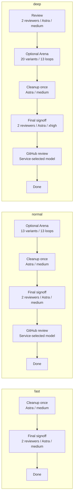

# Review workflow

<!-- Generated by scripts/generate-workflow.py; do not edit by hand. -->

Shipped defaults, without personal overrides. Arena is optional and **disabled by default**; its configured loops are shown below.

Reviewers report findings; fixes are reviewed before advancing. Cleanup runs once before final signoff and does not repeat after later fixes. Required validation must pass before completion.

Regenerate with `uv run --locked python scripts/generate-workflow.py`. CI runs the same command with `--check` to catch stale output.
